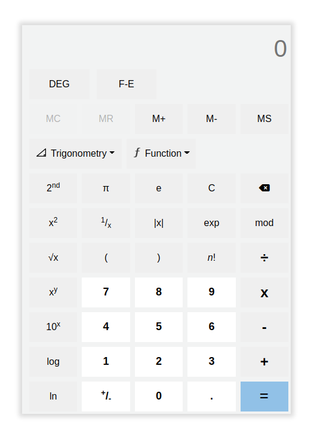

# scientific-calculator
- This is a website that contains a scientific calculator which performs the basic and advance mathematical operations.
- The website is responsive and has an interactive UI.
- **Live Demonstration** : [Calculator](https://riteshadwani.github.io/scientific-calculator/)
 *********

 ## Tech Stack:
 - The website is built with famous web development tools, they are mentioned below:
 

 **********

 ## Screenshot:
 ;

 **********

 ## Features and Functionalities:
 **1. Basic Mathematic Operations:**
 - Addition(+)
 - Subtraction(-)
 - Multiplication(x)
 - Division(+)
 - Modulo(mod)
 - Square and Square root
 - Cube and Cube root
 - Inverse(1/x)
 - Absolute value(|x|)
 - Factorial(n!)

 **2. Logarithmic Functions:**
 - log to base 10(log)
 - natural log(ln)
 - log to base 2(log2X)

 **3. Trigonometric functions and Other Math functions:**
 - sin
 - cos
 - tan
 - floor function
 - ceiling function
 - Degree to Radian and Radian to Degree
 - Convert to exponential
 - Specific root of a number (y√x)
 
 **4. Exponential Functions:**
 - e^x
 - x^y
 - 10^x
 - 2^x

**5. Memory Operations:**
- Add to memory(M+)
- Subtract from memory(M-)
- Store in memory(MS)
- Memory Recall(MR)
- Clear memory(MC)

**********

## Important points:
**1. DEG Button**
- The `DEG` is a toggle button.
- It converts radian value to degree.
- On clicking it, you get the option to convert Radian to Degree and the button text become "RAD".

**2. 2nd Button**
- `2nd` is also a toggle button.
- On clicking it, you get a new column displayed below it, which contains more mathematical functions.

**3. F-E Button**
- It converts the value in the form of exponential number.

